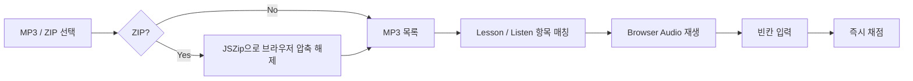

# 🎧 ENexam

### 영어 듣기 수행평가를 브라우저에서 반복 연습하기.

  
  
  
  

### [▶ Open on GitHub Pages](https://rudwpahs.github.io/ENexam/)

[Features](#features) · [Audio Flow](#audio-flow) · [Use](#use)

---

중학교 영어 3학년 Lesson 5·6·7 듣기 수행을 반복해서 연습하려고 만든 웹앱입니다. 교과서 MP3를 저장소에 복사하는 대신 **사용자가 가진 음원을 브라우저에서 직접 불러옵니다.**

## Features

- Lesson 5·6·7 Listen & Talk 1 / 2
- 5·6·7과 필터
- `0.8× / 1.0× / 1.2×` 재생 속도
- 5초 되감기
- 빈칸 즉시 채점과 정답 보기
- 혼합 모의 연습

## Audio flow

> **MP3는 서버로 전송하지 않습니다.** 사용자가 고른 파일을 브라우저 안에서만 읽습니다.

이 방식 덕분에 교과서 음원을 저장소나 서버에 복사하지 않고도 실제 가지고 있는 음원으로 연습할 수 있습니다.

## Use

1. 사이트에서 `MP3/ZIP 선택`을 누릅니다.
2. 전체 ZIP, 5·6·7과 ZIP 또는 개별 MP3를 선택합니다.
3. 처음에는 `1.0×`, 어려운 부분은 `0.8×`로 반복합니다.

GitHub HTML Preview도 사용할 수 있습니다:

`https://html-preview.github.io/?url=https://github.com/Rudwpahs/ENexam/blob/main/index.html`

## Stack

`HTML` · `CSS` · `JavaScript` · `JSZip` · Browser Audio API · GitHub Pages
